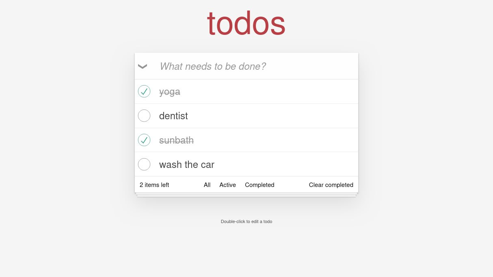

# 📝 Todo with MiniFramework

A Todo application built using a custom-engineered JavaScript framework. This project was created to explore the mechanics of Virtual DOM reconciliation, component lifecycles, and client-side routing without relying on external heavy-weight libraries.

## 🖼️ Project Walkthrough

### 🏠 Home View: The Clean Slate
The landing state of the application. A distraction-free entry point featuring the main input field.

---

### 💬 Task Management: Progress in Action
The application in use, showing a mix of active and completed tasks. Notice the custom SVG checkmarks and the "Items left" counter, which updates in real-time as the Diffing Algorithm patches the DOM.

---

### ✍️ Inline Editing: Direct Manipulation
A view of the "Active" filter with a task in Edit Mode. Triggered by a double-click, the editView logic swaps the label for a text input, allowing for immediate updates without leaving the page.

## 🛠️ Core Features

* **Custom VDOM:** Lightweight createElement engine for fast UI updates.
* **Smart Diffing:** Recursive reconciliation updates only changed DOM nodes.
* **Reactive State:** Component-based architecture with automatic setState re-renders.
* **Hash Router:** Built-in routing for Active and Completed task views.
* **Auto-Save:** Seamless LocalStorage integration for data persistence.

## 📂 File Guide

* `lib/dom.js` **– The Core:** Framework engine, VDOM diffing, and Base Component.
* `main.jsx`**– The Logic:** Main TodoApp and TodoItem application code.
* `index.html` **– The Entry:** HTML skeleton and framework injection point.
* `babel.min.js` **– The Translator:** On-the-fly JSX compilation in the browser.

## 🚦 Getting Started

Prerequisites
You need Node.js installed on your machine to run the development server.

Installation
1. Clone the repository or navigate to the folder.
2. Install the CSS dependencies:
    `Bash: npm install`

Running the App
Start the development server:
    `Bash: npm run dev`

Open http://localhost:5173 in your browser to view the app.

## ⌨️ Features

* Create: Add tasks via the main input.
* Edit: Double-click any task text to enter edit mode.
* Filter: Toggle between All, Active, and Completed views.
* Persistence: Your todos are automatically saved to your browser's local storage.
